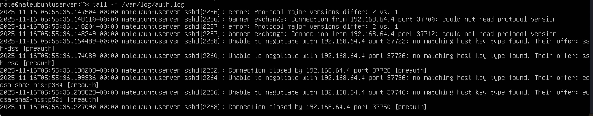

# SOC Detection Lab (Kali → Ubuntu)

Real attacker-victim lab for learning SOC detection skills.

**Tools:** Kali Linux, Ubuntu Server, Nmap, Nikto, SSH, Apache2, Linux logs  
**Goal:** Generate attacks → detect them in real time → block them

## Attacks Simulated
- Full port scan + OS detection (`nmap -A`)
- Vulnerability scan (`nmap --script vuln`)
- Web enumeration (`nikto -h <target>`)
- SSH brute-force simulation

## Detection Evidence
- Real-time monitoring of `/var/log/auth.log` and `/var/log/apache2/access.log`
- Clear indicators of compromise (failed passwords, port scans, 404 probing)

## Screenshots

**Skills Demonstrated:** Network reconnaissance, log analysis, incident detection, attacker TTPs
